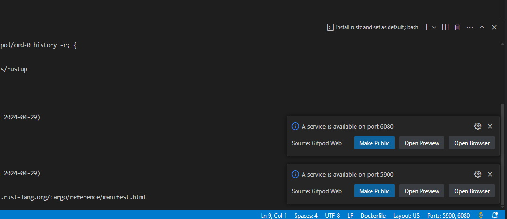
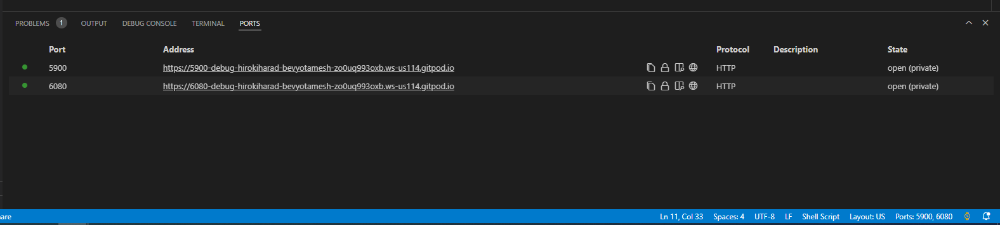
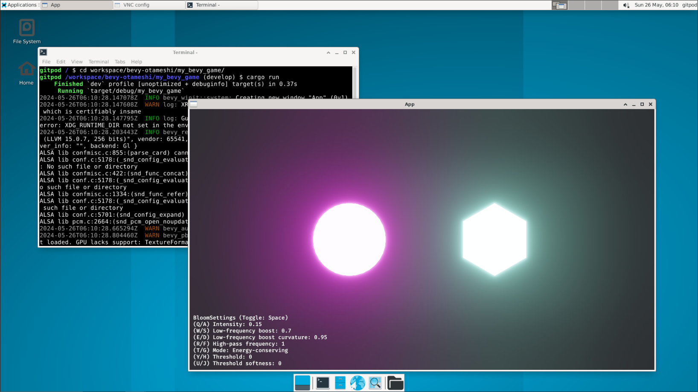

# bevy-otameshi
bevy をお試しで使うためのリポジトリ

[](https://gitpod.io/new/#https://github.com/hiroki-harada/bevy-otameshi)

# directories and files
重要なやつだけ記載
```bash
/workspace/bevy-otameshi
|--.gitpod.Dockerfile # gitpod用Dockerfile
|
|--.gitpod.yml # gitpod環境を構成する設定ファイル
|
|--my_bevy_game # bevy engine のプロジェクト(※1)、gitpod のセットアップ時にとりあえず作ってる
|  |--Cargo.lock
|  |--Cargo.toml
|  |--src
|     |--main.rs
|
|--setup-bevy.sh # bevy engine セットアップ用のスクリプト、my_bevy_game の作成はここら辺で実行
```
※1: 厳密にはパッケージ


# how to use
## デスクトップ環境の起動
gitpod を起動して環境を立ち上げると、画面右下に↓が表示される

port 6080 の方を選択するとデスクトップ環境が開く(open browser だと別タブで開くので、主にそっちを使っている)



もしくは、PORTS タブから選択する




## サンプルプロジェクトの実行
[GitHub - bevy/examples](https://github.com/bevyengine/bevy/tree/latest/examples) から適当なソースを `src/main.rs` に上書きして実行できることを確認してみる

デスクトップ環境を開いたら、プロジェクト直下で `cargo run` で作成したプロジェクトを実行(未ビルドの場合は、ビルドも実行される)
```bash
/workspace/bevy-otameshi/my_bevy_game $ cargo run
```


↓は、[2d/bloom_2d](https://github.com/bevyengine/bevy/blob/latest/examples/2d/bloom_2d.rs) を適用した時のキャプチャ




# reference
デスクトップ環境の作成については、ここを参考 [Developing native UI applications in Gitpod](https://www.gitpod.io/blog/native-ui-with-vnc)

bevy engine のセットアップは、ここを参考 [Bevy Engine Quick Start](https://bevyengine.org/learn/quick-start/introduction/)
